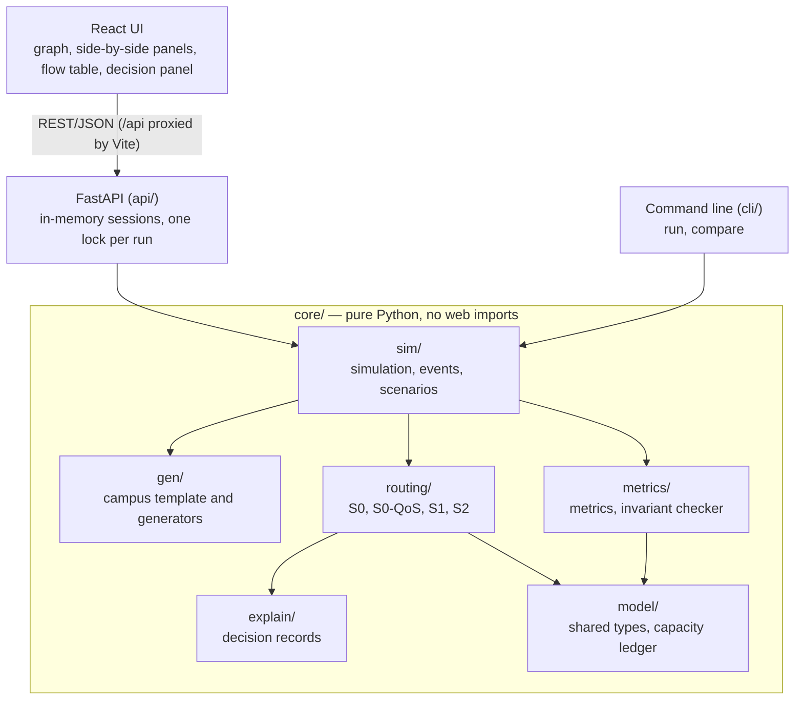

## Problem statement

**Problem Statement 4: Network Rerouter.**

> Develop a network simulation and rerouting system that responds to link failures and attempts to maintain critical communication while efficiently using the remaining network capacity.


# Network Rerouter

When a link fails on a campus network, routing usually sends everything onto the next-shortest path, even if that path is already full. Network Rerouter is a simulator of a campus network with a central routing controller. You fail and recover links. After each event the controller recomputes every route, and the system shows what was delivered, what was not, and why.

It compares four routing policies on exactly the same network, traffic and failures:

| Policy | What it does | Role |
|---|---|---|
| **S0** | Shortest path by latency. No capacity check and no priority; an overloaded link loses traffic in proportion | Naive floor |
| **S0-QoS** | The same routes as S0, but each overloaded link serves traffic classes in strict priority order | **The baseline we compare against**: what QoS queueing gives without rerouting |
| **S1** | Our allocator with arrival order, one path per flow and latency-only cost | Ablation: what capacity awareness alone is worth |
| **S2** | Our allocator: critical traffic first, each flow placed on the residual-capacity graph and split over up to 3 paths | **Our policy** |

## Team

**Team: Claude Maxxers**

| Member | Roll number | Role | Owns |
|---|---|---|---|
| Hemanth Vasudev | 24pw16 | A: routing | `core/routing/`, `core/explain/` |
| Jithendra | 24pw37 | B: simulation, model, metrics | `core/model/`, `core/gen/`, `core/sim/`, `core/metrics/` |
| Varunesh | 24pw28 | C: frontend | `frontend/` |
| Nithiish | 24pw24 | D: integration and QA | `api/`, `tests/`, `cli/`, and the cycle 2 additions in `ext/` and `examples/` |


We read it as follows. Model a campus network carrying traffic of different importance. Let users create or generate a topology, and fail and recover links. Then reroute traffic so that critical services keep working, no link is driven past its capacity, and every decision can be explained.

## What it does

- **Builds a network** from the hand-drawn campus template (15 nodes) or the seeded generator (about 50 nodes and 200 flows by default), from the UI or the command line.
- **Classifies traffic:**
  - P0 is critical: authentication and emergency services.
  - P1 is academic traffic.
  - P2 is best effort.
- **Fails and recovers links or whole nodes.** After each event every flow is rerouted from scratch, so the result depends only on which links are down, never on the order of events.
- **Shows the baseline and S2 side by side**, with the same event applied to both:
  - links coloured by utilization, with overloaded links in a separate colour;
  - a strip of headline numbers per side;
  - a flow table;
  - each flow's route highlighted on the graph.
- **Explains every unserved flow:**
  - the shortest path and why it was not used;
  - each placement attempt;
  - the cause, one of `DISCONNECTED`, `INSUFFICIENT_CAPACITY`, `PATH_LIMIT` or `OVERLOAD_LOSS`;
  - the saturated or failed links that cut the flow off;
  - a max-flow check showing whether more traffic could have fitted.
- **Keeps every result reproducible.** The same scenario, settings and seed always give the same output.

## Scope

- **What we built** is a steady-state simulation of a central routing controller's decisions. It does not configure or control real switches.
- **The intended deployment** is an SDN island at the campus aggregation and core layer, which the campus template models. It would route aggregate flows (building × class, about 200), not per-user rules.
- **The path to deployment is future work and is not built.** Routes computed here would be installed through an SDN controller (Ryu, or its maintained fork os-ken) on Open vSwitch. That would be checked first in Mininet, a network emulator, then on an SDN island beside the existing switches.

## Technologies

| Part | Stack |
|---|---|
| Core library | Python 3.11+, pydantic 2.12.5, networkx 3.5 (pinned exactly, so tie-breaking cannot differ between machines) |
| API | FastAPI 0.142.4 and uvicorn 0.53.0. REST only; the OpenAPI schema is committed as `api/openapi.json` |
| Command line | Python standard library `argparse` |
| Tests | pytest 8.4.2, hypothesis 6.135.0 (property tests), httpx 0.28.1 (API tests); Vitest and Testing Library for the frontend |
| Frontend | React 18, Vite 6, TypeScript 5, Cytoscape.js (graph), Recharts (charts), lucide-react (icons). API types are generated from the OpenAPI schema with `openapi-typescript` |
| Optional | scipy (HiGHS), only for the LP reference in `core/routing/lp_reference.py` |
| Process | Git and GitHub with pull requests and CI (GitHub Actions), [OpenSpec](https://github.com/Fission-AI/OpenSpec) for spec-driven changes |

No database, containers, machine learning or external services. Everything runs locally from two commands.

## Run it

You need Python 3.11 or newer and Node.js 18 or newer.

**Backend** (port 8000):

```bash
python -m venv .venv
source .venv/bin/activate          # Windows: .venv\Scripts\activate
pip install -e ".[dev]"
uvicorn api.app:app --port 8000
```

**Frontend** (port 5173, in a second terminal; requests under `/api` are passed to the backend):

```bash
cd frontend
npm install
npm run dev
```

Open <http://localhost:5173>. These URL options are useful for a demo:

| URL | Effect |
|---|---|
| `?scenario=02_uplink_failure` | Opens that scenario |
| `?demo=1` | Larger headline numbers for a projector |

To run the frontend without the simulation, start the backend with `REROUTER_MOCK=1 uvicorn api.app:app --port 8000`. It answers from the fixtures, and the UI shows a MOCK DATA badge.

**A demo with no server at all:** open a saved comparison with the UI's "Load saved run" control. A ready one is `demo/fallback.json`: S0-QoS, S0 and S2 on `02_uplink_failure`, healthy and then with L6 failed. To save your own:

```bash
python -m cli compare --scenario 02_uplink_failure --policies S0-QoS S2 --out fallback.json
```

### Demonstrating it

The full timed script, with the numbers to quote and answers to likely judge questions, is [`demo/script.md`](demo/script.md). In short:

1. Open `02_uplink_failure`. The left panel runs S0-QoS and the right panel runs S2, with the same traffic on both.
2. Click link **L6**, the primary uplink, to fail it in both panels.
3. **Left, S0-QoS:** traffic piles onto the backup link, which turns the overload colour. Critical traffic survives through priority, but academic traffic is dropped.
4. **Right, S2:** the load is split over the remaining paths, and no link is overloaded.
5. Click an unserved flow to see its decision record and one-line explanation.
6. Switch the left panel to S0 to see critical traffic lost as well when there is no priority.
7. Use the "Generate network" form (buildings, redundancy, seed) to load a new campus network in both panels.

### Command line and tests

```bash
python -m cli run --scenario 07_diamond --policy S2 --out run.json     # snapshot sequence as JSON
python -m cli compare --scenario 07_diamond                            # S0, S0-QoS, S1, S2 per step
python -m cli benchmark --seeds 30 --out results                        # seeded benchmark matrix: CSV and summary
python -m cli report --dir results                                     # tables and the H1 to H5 verdicts
python -m cli run --scenario 07_diamond --policy S2 --max-paths 1      # flags: --order --max-paths --lambda --util-cap
pytest                                                                 # backend: unit, API, CLI and property tests
cd frontend && npm test                                                # frontend
```

`--scenario` takes one of the eight built-in ids or a scenario JSON file:

| Id | Scenario |
|---|---|
| `01_normal` | Normal operation |
| `02_uplink_failure` | Primary uplink fails |
| `03_three_links` | Three links fail at once |
| `04_congestion` | One alternative route is nearly full |
| `05_insufficient_capacity` | Demand exceeds the network's capacity |
| `06_disconnected` | A hostel is cut off |
| `07_diamond` | The worked example below |
| `08_recovery` | A link fails, then recovers |

### Reproduce a run from a seed

A scenario is data: a topology spec, a traffic spec, a list of events and a seed. This file generates a network, fails link L6 at step 1, and can be run with `python -m cli run --scenario gen.json --policy S2 --out a.json`:

```json
{
  "id": "gen", "seed": 7, "config": {},
  "topology": {"generator": "campus", "buildings": 37, "redundancy": 0.5, "seed": 7},
  "traffic": {"generator": "campus", "n_flows": 200, "load_factor": 0.5,
              "class_mix": {"0": 0.1, "1": 0.4, "2": 0.5}, "seed": 7},
  "events": [{"step": 1, "kind": "fail", "links": ["L6"]}]
}
```

Running it twice gives identical files, apart from `metrics.compute_ms`, which is wall-clock time; a test checks this.

The generator retries the next seed if a network fails the check described under assumptions below. The seed it actually used is echoed in the output `scenario.topology.seed`.

All randomness goes through an explicit `random.Random(seed)`. Iteration is sorted by id, and path costs are integers with a fixed tie-break.

### Try your own input

The `examples/` folder holds scenario files meant to be edited. Each runs with one command:

| File | What it is | Command |
|---|---|---|
| `examples/custom-flow.json` | The campus template plus one P0 flow, `F20`, from Admin (`B4`) to Engineering (`B1`) | `python -m cli run --scenario examples/custom-flow.json --policy S2` |
| `examples/custom-failure.json` | The campus template; links `L6`, `L11` and `L13` fail at step 1 and `L6` recovers at step 2 | `python -m cli run --scenario examples/custom-failure.json --policy S2` |
| `examples/overload.json` | The campus template with 40 generated flows at 1.5 times the normal load | `python -m cli run --scenario examples/overload.json --policy S2` |

Swap `run ... --policy S2` for `compare` to see all four policies side by side. A file can also be posted to `POST /runs` as an inline `scenario`.

What to edit:
- **A flow, in `traffic`:**
  - `src` and `dst`: node ids `B1` to `B5` (buildings), `H1` and `H2` (hostels), or `AUTH`, `EMRG`, `LMS`, `INET` (services);
  - `rate`: integer Mbps;
  - `cls`: 0, 1 or 2 for P0, P1 or P2.
- **A failure, in `events`:**
  - `links`: link ids `L1` to `L21`; L6 is the primary uplink;
  - `node`: instead of `links`, fails every link attached to that node;
  - `kind`: `fail` or `recover`;
  - `step`: the order in which events are applied.
- **The load, in `overload.json`:** `traffic.load_factor` and `traffic.n_flows`.
- **The policy settings, in `config`:** `max_paths`, `order`, `congestion_lambda` and `util_cap`.

An unknown node or link id stops the run with an error naming that id.

## The model

- **Fluid and steady-state.** Flows are constant-rate demands in Mbps. There are no packets, queues or protocol convergence.
- **One central controller** sees the whole topology and all traffic, as in software-defined networking.
- **Links are full duplex.** Each link is two directed arcs with the link's capacity. A failure takes both down, and utilization is measured per arc.
- **Inputs are integers:** capacities and rates in Mbps, latencies in ms. S1 and S2 allocations stay integer. S0 and S0-QoS deliveries are fractions, compared with a tolerance of 1e-9.
- **Flows can be split** over up to `max_paths` paths (3 by default; 1 means unsplittable).
- **A node failure** fails every link attached to the node.

**Constraints S1 and S2 always satisfy:**
- no failed link is used;
- every path is a simple path from source to destination;
- a flow never receives more than it asked for;
- no arc carries more than its effective capacity, `floor(util_cap × capacity)`;
- a flow uses at most `max_paths` paths.

S0 and S0-QoS do not respect capacity; that is what they are measured on.

**Objectives,** in strict order:
1. delivered P0 traffic;
2. delivered P1 traffic;
3. delivered P2 traffic;
4. lower congestion;
5. lower latency.

## The algorithm (S1 and S2)

One allocator with a settings object:

```
allocate(topology, flows, settings):
    ledger = residual capacity of every available arc   # starts empty on every event
    for flow in flows ordered by class (P0 first), then by size:
        if source and destination are disconnected:
            unserved, cause DISCONNECTED; continue
        remaining = flow.rate
        while remaining > 0 and paths used < max_paths:
            p = cheapest path over arcs with residual > 0   # Dijkstra, ties broken by (cost, hops, node ids)
            if no path: break
            x = min(remaining, bottleneck(p))
            reserve x on p; remaining -= x
        if remaining > 0:
            cause = PATH_LIMIT if a residual path still exists else INSUFFICIENT_CAPACITY
            record the cut (the saturated or failed arcs separating source from destination)
            maxflow_bound = most this flow could have received, given higher-priority flows
            greedy_gap    = maxflow_bound - delivered
```

- **Cost.** Each push either satisfies the flow or saturates an arc, so a flow takes at most `max_paths + 1` shortest-path searches. The total is O(F · m · E log V), with no path enumeration and no solver.
- **Why every event recomputes everything.** Rerouting only the affected flows could let an unaffected P2 flow keep capacity that an affected P0 flow needs. The price is that lower-class flows sometimes move ("churn"), which is measured.
- **What it guarantees:**
  - the constraints above;
  - **class isolation:** a class's allocation is the same as if no lower class existed, so lower-priority traffic can never take capacity from higher-priority traffic (with the default class-first ordering);
  - determinism.
- **What it does not guarantee:** the most traffic possible. It is a greedy heuristic, so the decision record reports `greedy_gap` for every unserved flow.
  - When `greedy_gap = 0`, the shortfall is real and the cut explains it.
  - When `greedy_gap > 0`, the explanation says the heuristic or the path limit is to blame.

**The two baselines.** S0 routes each flow on its latency-shortest path. An overloaded arc scales all its traffic by `capacity / load`. S0-QoS uses the same routes, but each arc serves P0, then P1, then P2 from what capacity is left.

### Worked example

The diamond: links A-B and B-D have capacity 10 and latency 1; A-C and C-D have capacity 10 and latency 2. F1 is a P0 flow from A to D at 15 Mbps; F2 is a P2 flow from A to D at 10 Mbps. These numbers were worked by hand before any code existed, and the tests check them.

**Healthy network:**

| Policy | What happens | P0 delivery | Total delivery | Overloaded arcs |
|---|---|---|---|---|
| S0 | Both flows on A-B-D; 25 Mbps on a 10 Mbps link | 0.40 | 0.40 | 2 |
| S0-QoS | Both on A-B-D; P0 takes the whole link | 0.667 | 0.40 | 2 |
| S2 | F1 is split, 10 on A-B-D and 5 on A-C-D; F2 gets the other 5 on A-C-D | **1.00** | **0.80** | **0** |

**B-D fails:** S0 delivers P0 0.40, while S0-QoS and S2 both deliver P0 0.667. All three deliver 0.40 in total, but only S2 overloads nothing.

While a second path exists, S2 beats the QoS baseline by using capacity the shortest path leaves idle. When only one path is left, rerouting cannot create capacity, and S2 and S0-QoS deliver the same.

### ECMP-style baseline (cycle 2)

"Why not just ECMP?" is the obvious question, so there is a third pair of baselines: `ECMP`, which loses traffic proportionally like S0, and `ECMP-QoS`, which uses strict priority like S0-QoS.

**How it routes:**
- At each router, the traffic arriving for a destination is split equally over the equal-cost next hops: the neighbours on a latency-shortest path. There are at most 8 next hops, ordered by neighbour id and then link id.
- Path rates stay whole Mbps: a 15 Mbps flow over two next hops sends 8 one way and 7 the other.
- This is an **idealised** equal split. Real routers hash whole flows onto next hops, so they never split one flow's rate exactly.

**Results on hand-worked topologies:**

| Topology | S0-QoS | ECMP-QoS | S2 |
|---|---|---|---|
| Square: two equal paths of capacity 10; a P0 flow of 15 and a P2 flow of 10 | DR 0.40, 2 overloaded arcs | DR 0.80, 4 overloaded arcs | DR 0.80, 0 overloaded |
| Eight equal routes of capacity 10; one P0 flow of 100 | delivers 10 | delivers 80, 16 overloaded arcs | delivers 30 at the default `max_paths` 3; **80 at `--max-paths 8`**, 0 overloaded |

ECMP-QoS can deliver more than S2. On the eight routes, S2's default limit of 3 paths per flow leaves 70 Mbps unserved, and its decision log says so itself: cause `PATH_LIMIT`, and a greedy gap of 50 Mbps that could have been routed. With `--max-paths 8`, S2 delivers the same 80 Mbps and overloads nothing. So comparisons with ECMP are always reported at both path limits, with delivery and overload as separate outcomes, never combined into one score.

```bash
python -m ext compare --scenario examples/square.json --policies S0-QoS ECMP-QoS S2
python -m ext compare --scenario examples/eight-paths.json --policies S0-QoS ECMP-QoS S2
python -m ext run --scenario examples/eight-paths.json --policy S2 --max-paths 8
```

`python -m ext run` and `compare` are the cycle-1 commands with ECMP added. The ECMP examples (`square`, `shared-prefix`, `eight-paths`) need `python -m ext`, because their small topologies are registered there and not in the frozen `fixtures/`.

## Architecture



Each event follows the same steps:

1. The `Simulation` applies the event.
2. It finds the affected flows.
3. It calls `policy.route(...)`.
4. `metrics/` computes the snapshot from the topology, flows and allocation alone, so the reported numbers cannot disagree with the simulated state.

The core never imports the API or the frontend; a test checks this.

**REST API:**

| Endpoint | Purpose |
|---|---|
| `GET /scenarios` | List the built-in scenarios |
| `POST /runs` | Start a run from a scenario id or an inline scenario, including a generated one |
| `POST /runs/{id}/events` | Fail or recover links or a node |
| `POST /runs/{id}/reset` | Return to step 0 |
| `POST /compare` | Run several policies on one scenario's full event list |
| `GET /runs/{id}/flows/{flow_id}/decision` | One flow's decision record |

## How we know it is correct

- **Eleven invariants (I1 to I11) are checked in the tests.** The checker shares no code with the policies.
  - On every snapshot: no failed link used, no capacity exceeded by S1 or S2, demand accounting, metrics recomputed independently, and explanations consistent with the max-flow bound.
  - Across two runs: determinism (I8) and class isolation (I10).
  - In the capacity ledger's own tests: the ledger's bookkeeping (I5).
- **Property tests** generate random campus networks with link and node failures and run every invariant under all four policies. A failure prints a line that replays it.
- **Expected numbers are worked by hand** before the code: the diamond table and the eight scenario fixtures.
- CI runs the backend tests, the frontend build and tests, and a commit-history check on every pull request.

## Results

The 30-seed benchmark ran on commit `f45c9c0`; `core/` and `cli/` have not changed since. Full tables are in [`results/tables.md`](results/tables.md), every row is in `results/benchmark.csv`, and the configuration is in `results/summary.json`. Reproduce it with `python -m cli benchmark --seeds 30 --out results`, then `python -m cli report --dir results`.

**Setup:**
- 30 generated campus networks (about 50 nodes and 200 flows each), all four policies, offered load factors 0.5 to 2.0, and one-setting S2 ablations: 3960 runs in 88 s.
- Four cases per seed, mapped to the fixture scenarios they resemble:

  | Case | What fails | Like scenario |
  |---|---|---|
  | `healthy` | nothing | 1 |
  | `uplink` | the primary uplink | 2 |
  | `multi` | three random links at once | 3 |
  | `recovered` | three random links, which then recover | 8 |

  Load factors above 1.0 give scenario 5's regime, where there is not enough capacity.
- H1 and H1b are read on `uplink` and `multi` at load 1.0; H2 on `healthy` and `recovered` at load 0.5.
- Differences are S2 minus S0-QoS per seed, in percentage points, with 95% bootstrap intervals.

**Hypotheses** (fixed before the run, reported either way):

| Hypothesis | Criterion | Result | Measured |
|---|---|---|---|
| H1 | Under stress, S2's `DR` beats S0-QoS by at least 10 points, with the interval above 0 | **passed** | +14.0 points (95% CI +13.1 to +15.1) |
| H1b | Under stress, S2's P0 delivery is not more than 1 point below S0-QoS | **passed** | +0.00: a tie |
| H2 | Uncongested, S2 is within 1 point of S0-QoS | **failed** | `DR` +2.1 points (CI +1.6 to +2.6), outside the band in S2's favour; P0 delivery +0.00 |
| H3 | S2 never overloads a link; S0 and S0-QoS do under stress | **passed** | S2 overloaded no arc in any of 1800 runs; S0 and S0-QoS overloaded arcs in 60 stress runs each |
| H4 | A recompute at 50 nodes and 200 flows takes under 1 second | **passed** | median 51 ms |
| H5 | The P0 greedy gap is zero in at least 95% of runs | **passed** | zero in all 720 default S2 runs |

**Total delivery (`DR`), S2 against S0-QoS:**

| Load factor | Primary uplink failed: S0-QoS | S2 | Difference | Three links failed: S0-QoS | S2 | Difference |
|---|---|---|---|---|---|---|
| 0.5 | 0.970 | 0.997 | +2.7 | 0.955 | 0.974 | +2.0 |
| 1.0 | 0.823 | 0.981 | **+15.8** | 0.831 | 0.954 | **+12.3** |
| 1.5 | 0.584 | 0.918 | +33.4 | 0.599 | 0.909 | +31.0 |
| 2.0 | 0.460 | 0.791 | +33.1 | 0.473 | 0.820 | +34.7 |

**What the numbers say:**
- **S2 delivers more, and the gap grows with load.** S0-QoS piles traffic onto shortest paths that overload, while S2 uses capacity those paths leave idle. Over the uplink failure and the three-link failure at load 1.0 together, the gain is 14 points (H1).
- **Critical traffic is a tie.** S0-QoS already protects P0 with its priority queues, so S2 matches it (within 0.03 points up to load 1.5) rather than beating it. S2 pulls ahead on P0 only at twice the normal load (+1.2 to +1.4 points). The gain is in P1 and P2 traffic: P1 delivery at load 1.0 is +3.1 points with the uplink failed.
- **H2 failed, in S2's favour.** We expected the two to be equal when uncongested. But at load 0.5, shortest-path routing already overloads about 4 arcs per network, and S2 delivers 2.1 points more.
- **S1 against S2** isolates the value of splitting and priority order. At load 1.0 with the uplink failed, S1 delivers 0.940 and S2 0.981. In the ablation, `max_paths` 1 costs S2 3.3 to 3.9 points; 2 or more paths make no difference. Ordering within a class and the congestion cost change delivery by at most 0.03 points; `util_cap` 0.9 costs 0.35 to 0.51 points.
- **These numbers include the baselines' single-pass bias** (see Limitations), which slightly understates S0 and S0-QoS.

**Single-link sensitivity** (`python -m ext sweep --scenario 01_normal`, cycle 2):
- **Method:** fail each link of the campus template alone, per policy.
- **Result:** for every single failure of a non-bridge link, S2 keeps all P0 traffic and overloads nothing. S0-QoS's worst case is the primary uplink L6, with total delivery 0.706 and one overloaded link.
- **Bridges:** the links whose loss cuts something off are listed separately, with the demand they disconnect: the core-to-service links L2 to L5 and the single-homed hostel links L20 and L21. This is a single-link analysis of one topology and traffic matrix, not a claim about simultaneous failures.

**Measured during development,** before the benchmark. Each number has its source.

| Measurement | Result | Source |
|---|---|---|
| Campus template with the primary uplink L6 failed: total delivery and P1 delivery | S2 **1.000** and **1.000**; S0-QoS 0.706 and 0.750 | Headline check (PR #11) |
| The same check in the live API | S0-QoS: 1 overloaded link, peak utilization 225%. S2: none overloaded, peak 100% | M1 check through the API |
| S2 recompute time at 50 nodes and 200 flows | 126 to 377 ms, worst 458 ms | Routing timing record (PR #4) |
| P0 greedy gap | Zero on 180 of 180 runs | Routing timing record |
| One event through the API at 50 nodes and 200 flows | About 60 ms and 144 KiB, of which decision records are 120 KiB | API measurement (PR #23) |
| Congestion cost (`--lambda` above 0) across 30 networks | 0.2 to 3.3 points less delivery and 7 to 30% more latency, so it is off by default. In the benchmark's ablation at load 1.0 it changed nothing measurable | Ablation (PR #13) |

## Challenges

Problems we met during the hackathon and how we handled them. New entries are added as they happen.

- **Four AI agents writing into one repository.** We set shared rules in `AGENTS.md`: each agent works only in its owner's folders, only humans edit the shared contract, and expected values are worked by hand. Every change went through a pull request with CI.
- **The UI needed data the contract did not carry.** A saved comparison could not be drawn offline without the topology and flows. These were added to the `/compare` response before the H1.5 freeze, with all members agreeing.
- **Mock data that looked real.** An external review found that mock-mode events changed link states without rerouting, so a failed link could appear in use. Live mode on the real simulation replaced it, and the UI now shows a MOCK DATA badge whenever mock mode is on.
- **Would S2 beat the QoS baseline at all?** We ran a headline check at H8 on the campus template before building anything further on that claim. With the uplink failed, S2 delivered 100% of traffic and 100% of P1 traffic, against 70.6% and 75% for S0-QoS.
- **The congestion cost did not pay off.** The ablation showed it lowered delivery and raised latency, so it is off by default rather than tuned until it looked useful.
- **Reproducible randomness.** Python randomises `hash()` per process, so every random choice uses its own `random.Random` with a seed derived arithmetically. Any run can be replayed from its seed.
- **Integration load on one member.** D's benchmark tasks were handed over to A partway through, so the API, command line, README and benchmark could proceed in parallel.
- **A CI-only failure.** Tests passed locally but failed in CI, because the `cli` package was not listed in `pyproject.toml`. Local runs had found it through the working directory.

## Limitations

- **The baselines use a single-pass delivery model.** Traffic lost on an upstream link still counts as load further down the path. This makes S0 and S0-QoS look slightly worse than they are, which favours S2.
  - An upstream-aware version that iterates to a fixed point is in the code (`upstream_aware=True`).
  - S0-QoS models strict-priority queueing as per-link, per-class scale factors, not real packet queues.
- **S2 is greedy, not optimal.** Flows are placed one at a time in a fixed order, so an early placement can block capacity a later flow needed, and `max_paths` limits splitting.
  - It can lose to a baseline on some inputs.
  - `greedy_gap` measures this per flow, and an optional LP reference (`core/routing/lp_reference.py`) gives a fractional upper bound on small networks.
- **Where S2 only ties.**
  - On critical (P0) traffic, S2 ties S0-QoS in every benchmark case up to 1.5 times the normal load (+0.00 to +0.03 points; H1b), because priority queueing already protects P0. Our gain is in total, P1 and P2 delivery, and in never overloading a link.
  - When one path is left, rerouting cannot create capacity: S2 and S0-QoS deliver the same, and S2's remaining advantage is that it overloads nothing.
  - S2 did not deliver less than S0-QoS on average in any benchmark case or load, but it is a heuristic, and single inputs where it loses can exist.
- **The model is steady-state.** There are no packets, queues, time-varying traffic, protocol convergence or cascading failures. Results describe this simulator on generated networks, not production networks.
- **Churn.** Every event reroutes everything in priority order, so lower-class flows may move even when their old path still works. Churn is measured and reported, not avoided.
- **Sessions live in memory.** Restarting the API loses runs. Seeds make any run reproducible, so nothing is lost for good.
- **Mock mode is for frontend work only.** Its events change link states but do not reroute.

## Technical contribution

1. **A priority allocator on the residual-capacity graph.** One shortest-path loop gives hard capacity safety, flow splitting and strict class priority, with **class isolation** as a guarantee.
2. **Cut-based explanations checked against a max-flow bound.** Every unserved flow says which links cut it off and who holds their capacity. It also reports whether the shortfall is physical (`greedy_gap = 0`) or the heuristic's fault (`greedy_gap > 0`), instead of presenting every drop as unavoidable.
3. **A fair baseline.** Every headline comparison is against shortest-path routing with QoS priority queueing, not against a strawman, and the cases where we only tie are stated.
4. **Measured claims.** There is an ablation for each setting, a congestion cost kept off because the data said so, and hypotheses fixed before the benchmark.

## Future work

- Replace the greedy push loop with a per-flow min-cost max-flow, so `greedy_gap` is zero by construction.
- Rip-up and reroute to repair greedy mistakes.
- A scaling study from 20 to 500 nodes.
- Vulnerability analysis: bridges, articulation points, and links ranked by the P0 traffic they carry.
- A Monte-Carlo robustness curve: P0 delivery against the number of random failures.
- Shared-risk link groups and precomputed disjoint backup paths for P0.
- Time-varying traffic and cascading failures.
- Importing real topologies, such as GraphML.

## External resources

- **Open-source libraries,** each used under its own licence. Every licence was read from the package's own LICENSE file, except scipy's: scipy is optional and not installed by default, so its licence is not checked here.

  | Backend | Licence | Frontend | Licence |
  |---|---|---|---|
  | pydantic | MIT | React, React DOM | MIT |
  | networkx | BSD-3-Clause | Vite, @vitejs/plugin-react | MIT |
  | FastAPI | MIT | Cytoscape.js | MIT |
  | uvicorn | BSD-3-Clause | Recharts | MIT |
  | pytest | MIT | lucide-react | ISC |
  | hypothesis | MPL-2.0 | TypeScript | Apache-2.0 |
  | httpx | BSD-3-Clause | Vitest | MIT |
  | scipy (optional) | BSD-3-Clause | Testing Library (react, jest-dom) | MIT |
  | | | jsdom | MIT |
  | | | openapi-typescript | MIT |
  | | | @types/cytoscape, node, react, react-dom | MIT |
- **The congestion cost** (off by default) uses the piecewise-linear link-cost slopes of B. Fortz and M. Thorup, "Internet traffic engineering by optimizing OSPF weights" (IEEE INFOCOM 2000).
- **Algorithms:** Dijkstra's shortest path and max-flow come from networkx.
- **Data:** none external. The campus network and traffic are generated or hand-drawn by the team.

## Use of AI tools

The rulebook (section 6.5) asks for this disclosure.

**Tools:** all four members used the same AI tools:

| Member | Tools | Used for |
|---|---|---|
| A, B, C and D | **Claude Code** (Anthropic) and **OpenCode** | Writing code, tests and documentation from the plan and the OpenSpec changes |
| A, B, C and D | **ChatGPT** (OpenAI) | Reviews, including an external review of the REST API |

**Rules the team set for the agents** (`AGENTS.md`, `CLAUDE.md`; PLAN.md section 11):
- Each agent edits only its owner's folders.
- The shared data contract (`core/model/types.py`, `fixtures/`, `api/openapi.json`) is changed by humans only, with all four members agreeing.
- Expected test values are worked by hand by a person before the code exists. An agent never writes both an implementation and the numbers it is tested against.
- No assertion is weakened or deleted to make a test pass.
- Every change goes through a pull request with tests and CI, and its owner reviews it and can explain it.
- The design came first: `PLAN.md`, then one OpenSpec change per module with a proposal, design, specs and tasks under `openspec/`.

Every member is responsible for understanding and explaining the code they submitted.

## Repository map

| Path | Contents |
|---|---|
| `core/` | The simulation library (model, generators, routing, explanations, simulation, metrics) with unit tests beside each module |
| `api/` | FastAPI app, live and mock backends, committed OpenAPI schema |
| `cli/` | `python -m cli` command line |
| `frontend/` | React app |
| `fixtures/` | Frozen contract fixtures and the eight scenario fixtures with their hand-worked expectations |
| `tests/` | Cross-module API, CLI and property tests |
| `examples/` | Editable scenarios for trying your own input |
| `ext/` | Cycle 2 additions: extra policies and analyses that build on `core/` without changing it |
| `results/` | The 30-seed benchmark: CSV, summary, tables and hypothesis verdicts |
| `demo/` | The demo script and the saved fallback run |
| `openspec/` | Proposals, designs, specs and tasks for each change |
| `PLAN.md` | The full design and plan; the source of truth |
